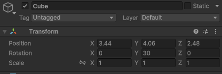
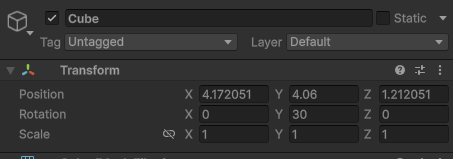
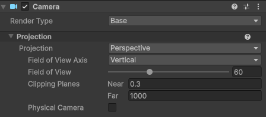
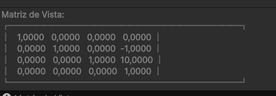

# 🧠 **Seminario: Mundos virtuales.**

> 💡 **Instrucciones:**  
> Responde a las siguientes cuestiones y, en los casos que sea posible, relaciónalas con los contenidos explicados en la sesión de *Mundos Virtuales*.  
> Usa ejemplos, imágenes o fragmentos de código cuando ayuden a ilustrar tu respuesta.

## 🌍 **Pregunta 1**
**🔹 Enunciado:**  
¿Qué funciones se pueden usar en los scripts de Unity para llevar a cabo traslaciones, rotaciones y escalados?  

**✏️ Respuesta:**  

Las funciones que se utilizan en Unity para realizar transformaciones en los *scripts* son las siguientes:

### 🔹 Traslaciones
- `Translate()`: permite mover un objeto de forma **relativa** respecto a su posición actual.  
  
  ```csharp
  transform.Translate(2, 0, 0); // Mueve el objeto 2 unidades en el eje X
  ```
### 🔹 Rotaciones
- `Rotate()`: realiza una rotación relativa expresada en grados.
  ```csharp
  transform.Rotate(0, 45, 0); // Rota el objeto 45º en el eje Y
  ```
- `LookAt()`: orienta el objeto para que mire hacia un punto objetivo.

  ```csharp
  transform.LookAt(target);
  ```
- `rotation`: define una rotación absoluta, normalmente usando `Quaternion`.

  ```csharp
  transform.rotation = Quaternion.Euler(0, 90, 0);
  ```
### 🔹 Escalado
- `localScale`: modifica el tamaño del objeto de manera absoluta en los tres ejes.

  ```csharp
  transform.localScale = new Vector3(2, 1, 1); // Escala el objeto al doble en el eje X
  ```

## 🌍 **Pregunta 2**
**🔹 Enunciado:**  
¿Cómo trasladarías la cámara 2 metros en cada uno de los ejes y luego la rotas 30º alrededor del eje Y?  
Rota la cámara alrededor del eje Y 30º y desplázala 2 metros en cada uno de los ejes.  
¿Obtendrías el mismo resultado en ambos casos? Justifica el resultado.  

**✏️ Respuesta:**  
  Para este caso hemos realizado dos scripts: uno de movimiento y rotación.  
  
👉[MovimientoRotación](./scripts/trasladarRotar.cs)



  Y el segundo para rotar y luego mover.
  
👉[RotacioónMovimiento](./scripts/rotarTrasladar.cs)



  Llegamso a la conclusión de que no es lo mismo rotar y mover que mover y rotar.Esto es porque la rotación cambia el sistema de ejes locales del objeto; si trasladas después, esa traslación se interpreta respecto a los ejes ya rotados, por lo que el vector de movimiento apunta en una dirección distinta. En cambio, si trasladas antes (cuando los ejes locales coinciden con los globales), la rotación posterior solo cambia la orientación del objeto y no su posición.


## 🌍 **Pregunta 3**
**🔹 Enunciado:**  
Sitúa la esfera de radio 1 en el campo de visión de la cámara y configura un volumen de vista que la recorte parcialmente.  

**✏️ Respuesta:**  
...

## 🌍 **Pregunta 4**
**🔹 Enunciado:**  
Sitúa la esfera de radio 1 en el campo de visión de la cámara y configura el volumen de vista para que la deje fuera de la vista.  

**✏️ Respuesta:**  
...

## 🌍 **Pregunta 5**
**🔹 Enunciado:**  
¿Cómo puedes aumentar el ángulo de la cámara? ¿Qué efecto tiene disminuir el ángulo de la cámara?  

**✏️ Respuesta:**  
 Podemos hacerlo con un script, pero de manera más comoda desde el inspector de escena.

 

 En el Inspector de la cámara, podemos modificar el parámetro "Field of View"  bajo la sección de "Projection". Aumentar el valor del "Field of View" hará que la cámara abarque un ángulo más amplio, lo que puede generar una sensación de mayor amplitud o de espacio abierto. Disminuir el ángulo, reduciendo el valor del Field of View , hace que la cámara tenga un ángulo más cerrado, lo que podría resultar en una sensación de claustrofobia o enfoque en un área más reducida.

## 🌍 **Pregunta 6**
**🔹 Enunciado:**  
¿Es correcta la siguiente afirmación?  
> “Para realizar la proyección al espacio 2D, en el inspector de la cámara, cambiaremos el valor de *Projection*, asignándole el valor de *Orthographic*.”

**✏️ Respuesta:**  
... En efecto esta sentencia si entendemos “proyección al espacio 2D” como una proyección sin profundidad (una vista ortográfica de un entorno 3D).

## 🌍 **Pregunta 7**
**🔹 Enunciado:**  
Especifica las rotaciones que se han indicado en los ejercicios previos con la utilidad `Quaternion`.  

**✏️ Respuesta:**  
... Para ello hemos modificada los 2 scrips anteriores implementado Quaterniones

👉[MovimientoRotación](./scripts/trasladarMQuaterniones.cs)

👉[RotacioónMovimiento](./scripts/rotarTQuaerniones.cs)

  Al implementar cuaterniones conseguimos  que las rotaciones se realizan de forma más precisa y estable, evitando los problemas de Gimbal Lock (bloqueo de ejes) que pueden ocurrir al usar rotaciones basadas directamente en ángulos de Euler.

## 🌍 **Pregunta 8**
**🔹 Enunciado:**  
¿Cómo puedes averiguar la matriz de proyección en perspectiva que se ha usado para proyectar la escena al último *frame* renderizado?  

**✏️ Respuesta:**  
...

## 🌍 **Pregunta 9**
**🔹 Enunciado:**  
¿Cómo puedes averiguar la matriz de proyección ortográfica que se ha usado para proyectar la escena al último *frame* renderizado?  

**✏️ Respuesta:**  
...

## 🌍 **Pregunta 10**
**🔹 Enunciado:**  
¿Cómo puedes obtener la matriz de transformación entre el sistema de coordenadas local y el mundial?  

**✏️ Respuesta:**  
...

## 🌍 **Pregunta 11**
**🔹 Enunciado:**  
¿Cómo puedes obtener la matriz para cambiar al sistema de referencia de vista?  

**✏️ Respuesta:**  
... Podemos obtenerla con un script en C# como el que hemos realizado para este caso.

👉[MatrizDeVista](./scripts/matrizVista.cs)



El resultado de la matriz de vista nos  dice dónde está la cámara y cómo está orientada en el espacio del mundo,


## 🌍 **Pregunta 12**
**🔹 Enunciado:**  
Especifica la matriz de proyección usada en un instante de la ejecución del ejercicio 1 de la práctica 1.  

**✏️ Respuesta:**  
...

## 🌍 **Pregunta 13**
**🔹 Enunciado:**  
Especifica la matriz de modelo y vista de la escena del ejercicio 1 de la práctica 1.  

**✏️ Respuesta:**  
...

## 🌍 **Pregunta 14**
**🔹 Enunciado:**  
Aplica una rotación en el método `Start()` de uno de los objetos de la escena y muestra la matriz de cambio al sistema de referencias mundial.  

**✏️ Respuesta:**  
... Este es el scipt que hemos usado para obtener la matriz de cambio.

👉[MatrizDeCambio](./scripts/matrizCambio.cs)

-FOTO DE RESULTADO Y EXPLICACION

## 🌍 **Pregunta 15**
**🔹 Enunciado:**  
¿Cómo puedes calcular las coordenadas del sistema de referencia de un objeto con las siguientes propiedades del `Transform`?  
- Position: (3, 1, 1)  
- Rotation: (45, 0, 45)

**✏️ Respuesta:**  
...

## 🌍 **Pregunta 16**
**🔹 Enunciado:**  
Crea una escena en Unity con los siguientes elementos:  
- Cámara principal  
- Plano base (como suelo)  
- Tres cubos de distinto color (rojo, verde y azul) en posiciones distintas  

Realiza un script de depuración adjunto a la cámara que muestre en consola o pantalla las matrices de transformación (`Model`, `View`, `Projection`) y sus resultados sobre un vértice de cada cubo.  

**✏️ Respuesta:**  
...

## 🌍 **Pregunta 17**
**🔹 Enunciado:**  
Dibuja en un programa el recorrido de las coordenadas de un vértice específico del cubo rojo:  
`Local → World → Camera/View → Clip → NDC → Viewport`.  
Indica cómo cambia su valor en cada espacio.  
Aplica la transformación manualmente a un punto (por ejemplo `(0.5, 0.5, 0.5)`) y registra los resultados paso a paso.  

**✏️ Respuesta:**  
...

## 🌍 **Pregunta 18**
**🔹 Enunciado:**  
Mueve o rota uno de los cubos y muestra cómo cambian los valores de su matriz de modelo.  
Rota la cámara y muestra cómo se modifica la matriz de vista.  
Cambia entre proyección ortográfica y perspectiva y compara las diferencias numéricas en la matriz de proyección.  

**✏️ Respuesta:**  
...

## 📝 **Notas finales**
- Utiliza formato Markdown para una mejor presentación:  
  - **Negrita** → conceptos clave  
  - *Cursiva* → ejemplos o aclaraciones  
  - `Código` → términos técnicos  
- Si una pregunta requiere un cálculo, inclúyelo así:

  ```text
  Ejemplo de cálculo:
  Z = X + Y / 2
