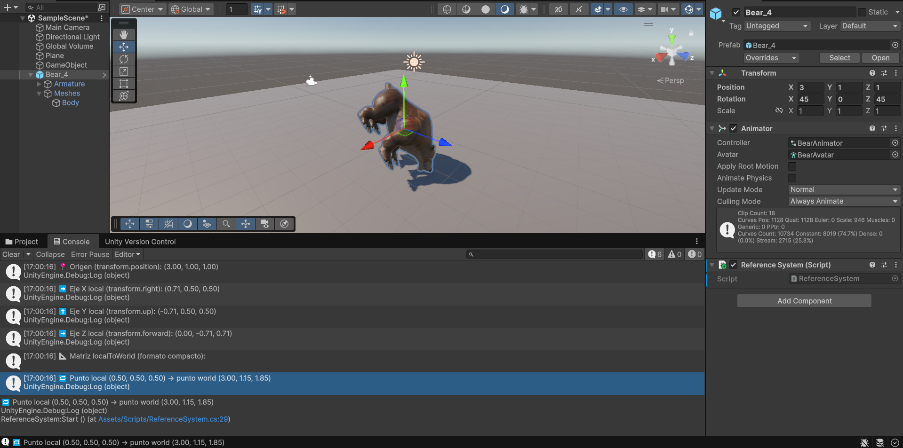

# 🧠 **Seminario: Mundos virtuales.**

> 💡 **Instrucciones:**  
> Responde a las siguientes cuestiones y, en los casos que sea posible, relaciónalas con los contenidos explicados en la sesión de *Mundos Virtuales*.  
> Usa ejemplos, imágenes o fragmentos de código cuando ayuden a ilustrar tu respuesta.

## 🌍 **Pregunta 1**
**🔹 Enunciado:**  
¿Qué funciones se pueden usar en los scripts de Unity para llevar a cabo traslaciones, rotaciones y escalados?  

**✏️ Respuesta:**  

Las funciones que se utilizan en Unity para realizar transformaciones en los *scripts* son las siguientes:

### 🔹 Traslaciones
- `Translate()`: permite mover un objeto de forma **relativa** respecto a su posición actual.  
  
  ```csharp
  transform.Translate(2, 0, 0); // Mueve el objeto 2 unidades en el eje X
  ```
### 🔹 Rotaciones
- `Rotate()`: realiza una rotación relativa expresada en grados.
  ```csharp
  transform.Rotate(0, 45, 0); // Rota el objeto 45º en el eje Y
  ```
- `LookAt()`: orienta el objeto para que mire hacia un punto objetivo.

  ```csharp
  transform.LookAt(target);
  ```
- `rotation`: define una rotación absoluta, normalmente usando `Quaternion`.

  ```csharp
  transform.rotation = Quaternion.Euler(0, 90, 0);
  ```
### 🔹 Escalado
- `localScale`: modifica el tamaño del objeto de manera absoluta en los tres ejes.

  ```csharp
  transform.localScale = new Vector3(2, 1, 1); // Escala el objeto al doble en el eje X
  ```

## 🌍 **Pregunta 2**
**🔹 Enunciado:**  
¿Cómo trasladarías la cámara 2 metros en cada uno de los ejes y luego la rotas 30º alrededor del eje Y?  
Rota la cámara alrededor del eje Y 30º y desplázala 2 metros en cada uno de los ejes.  
¿Obtendrías el mismo resultado en ambos casos? Justifica el resultado.  

**✏️ Respuesta:**  
...

## 🌍 **Pregunta 3**
**🔹 Enunciado:**  
Sitúa la esfera de radio 1 en el campo de visión de la cámara y configura un volumen de vista que la recorte parcialmente.  

**✏️ Respuesta:**  
...

## 🌍 **Pregunta 4**
**🔹 Enunciado:**  
Sitúa la esfera de radio 1 en el campo de visión de la cámara y configura el volumen de vista para que la deje fuera de la vista.  

**✏️ Respuesta:**  
...

## 🌍 **Pregunta 5**
**🔹 Enunciado:**  
¿Cómo puedes aumentar el ángulo de la cámara? ¿Qué efecto tiene disminuir el ángulo de la cámara?  

**✏️ Respuesta:**  
...

## 🌍 **Pregunta 6**
**🔹 Enunciado:**  
¿Es correcta la siguiente afirmación?  
> “Para realizar la proyección al espacio 2D, en el inspector de la cámara, cambiaremos el valor de *Projection*, asignándole el valor de *Orthographic*.”

**✏️ Respuesta:**  
...

## 🌍 **Pregunta 7**
**🔹 Enunciado:**  
Especifica las rotaciones que se han indicado en los ejercicios previos con la utilidad `Quaternion`.  

**✏️ Respuesta:**  
...

## 🌍 **Pregunta 8**
**🔹 Enunciado:**  
¿Cómo puedes averiguar la matriz de proyección en perspectiva que se ha usado para proyectar la escena al último *frame* renderizado?  

**✏️ Respuesta:**  
...

## 🌍 **Pregunta 9**
**🔹 Enunciado:**  
¿Cómo puedes averiguar la matriz de proyección ortográfica que se ha usado para proyectar la escena al último *frame* renderizado?  

**✏️ Respuesta:**  

Para obtener la matriz de proyección ortográfica usada por la cámara en el último frame renderizado, se puede acceder a la propiedad `camera.projectionMatrix` dentro de un script en Unity. Hemos realizado un pequeño script de depuración llamado **[`ProjectionDebugger.cs`](./Scripts/ProjectionDebugger.cs)**. Este script obtiene la cámara del objeto al que está adjunto y muestra por consola su matriz de proyección con formato legible.

## 🌍 **Pregunta 10**
**🔹 Enunciado:**  
¿Cómo puedes obtener la matriz de transformación entre el sistema de coordenadas local y el mundial?  

**✏️ Respuesta:**  
...

## 🌍 **Pregunta 11**
**🔹 Enunciado:**  
¿Cómo puedes obtener la matriz para cambiar al sistema de referencia de vista?  

**✏️ Respuesta:**  
...

## 🌍 **Pregunta 12**
**🔹 Enunciado:**  
Especifica la matriz de proyección usada en un instante de la ejecución del ejercicio 1 de la práctica 1.  

**✏️ Respuesta:**  
...

## 🌍 **Pregunta 13**
**🔹 Enunciado:**  
Especifica la matriz de modelo y vista de la escena del ejercicio 1 de la práctica 1.  

**✏️ Respuesta:**  
...

## 🌍 **Pregunta 14**
**🔹 Enunciado:**  
Aplica una rotación en el método `Start()` de uno de los objetos de la escena y muestra la matriz de cambio al sistema de referencias mundial.  

**✏️ Respuesta:**  
...

## 🌍 **Pregunta 15**
**🔹 Enunciado:**  
¿Cómo puedes calcular las coordenadas del sistema de referencia de un objeto con las siguientes propiedades del `Transform`?  
- Position: (3, 1, 1)  
- Rotation: (45, 0, 45)

**✏️ Respuesta:**  

Se ha utilizado el script **[`ReferenceSystem.cs`](./Scripts/ReferenceSystem.cs)**, que obtiene e imprime en consola la posición del origen y los ejes locales expresados en coordenadas globales. El script también muestra la matriz `localToWorldMatrix`, que combina traslación, rotación y escala, y permite transformar cualquier punto del espacio local a coordenadas mundiales.



## 🌍 **Pregunta 16**
**🔹 Enunciado:**  
Crea una escena en Unity con los siguientes elementos:  
- Cámara principal  
- Plano base (como suelo)  
- Tres cubos de distinto color (rojo, verde y azul) en posiciones distintas  

Realiza un script de depuración adjunto a la cámara que muestre en consola o pantalla las matrices de transformación (`Model`, `View`, `Projection`) y sus resultados sobre un vértice de cada cubo.  

**✏️ Respuesta:**  
...

## 🌍 **Pregunta 17**
**🔹 Enunciado:**  
Dibuja en un programa el recorrido de las coordenadas de un vértice específico del cubo rojo:  
`Local → World → Camera/View → Clip → NDC → Viewport`.  
Indica cómo cambia su valor en cada espacio.  
Aplica la transformación manualmente a un punto (por ejemplo `(0.5, 0.5, 0.5)`) y registra los resultados paso a paso.  

**✏️ Respuesta:**  
...

## 🌍 **Pregunta 18**
**🔹 Enunciado:**  
Mueve o rota uno de los cubos y muestra cómo cambian los valores de su matriz de modelo. Rota la cámara y muestra cómo se modifica la matriz de vista. Cambia entre proyección ortográfica y perspectiva y compara las diferencias numéricas en la matriz de proyección.  

**✏️ Respuesta:**  
Para responder a la pregunta se dividirá en tres apartados:  
1. El primero consiste en la rotación o movimiento de un cubo y exponer los valores de la matriz. Para ello se le hizo un movimiento a la posición (2, 1, 0) partiendo de (0, 0.5, 0). Además una rotación de 15º en X y Z. A continuación se muestran las matrices:

    🟦 Matriz inicial de modelo:
    | m00 | m01 | m02 | m03 |
    |:----:|:----:|:----:|:----:|
    | 1.000 | 0.000 | 0.000 | 0.000 |
    | 0.000 | 1.000 | 0.000 | 0.500 |
    | 0.000 | 0.000 | 1.000 | 0.000 |
    | 0.000 | 0.000 | 0.000 | 1.000 |

    🔁 Matriz de modelo actualizada:
    | m00 | m01 | m02 | m03 |
    |:----:|:----:|:----:|:----:|
    | 0,9659 | -0,2588 | 0,0000 | 2,0000 |
    | 0,2500 | 0,9330 | -0,2588 | 1,0000 |
    | 0,0670 | 0,2500 | 0,9659 | 0,0000 |
    | 0,0000 | 0,0000 | 0,0000 | 1,0000 |

2. El segundo consiste

┌──────────────────┐
│   1,0000   0,0000   0,0000   0,0000 │
│   0,0000   1,0000   0,0000  -1,0000 │
│   0,0000   0,0000  -1,0000 -10,0000 │
│   0,0000   0,0000   0,0000   1,0000 │
└──────────────────┘

┌──────────────────┐
│   0,7071   0,0000  -0,7071  -7,0711 │
│   0,0000   1,0000   0,0000  -1,0000 │
│  -0,7071   0,0000  -0,7071  -7,0711 │
│   0,0000   0,0000   0,0000   1,0000 │
└──────────────────┘

┌──────────────────┐
│   1,0000   0,0000   0,0000   0,0000 │
│   0,0000   1,0000   0,0000   0,0000 │
│   0,0000   0,0000  -1,0000   0,0000 │
│   0,0000   0,0000   0,0000   1,0000 │
└──────────────────┘